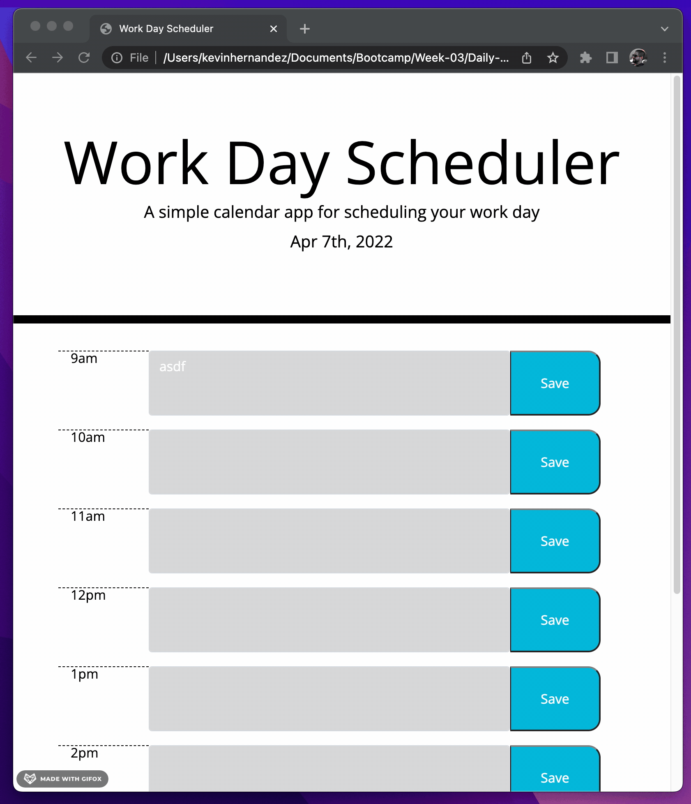

# Daily Planner

This page can help you keep track of your daily routine.
 
This is a demonstration of utilizing third party APIs, generating bootstrap content and HTML using jquery! Also powered by moment.js for time.

<ul>
<li>The planner portion changes colors depending on the time of day</li>
<li>The text when saved will stay in local storage and you can refresh the page and it'll still be there!</li>
<li>moment.js helps import a lot of important time methods that is used through the page</li>

</ul>
This page is designed to keep track of your daily tasks, feel free to give it a shot! link below

Check it out!
https://kh288.github.io/Daily-Planner/